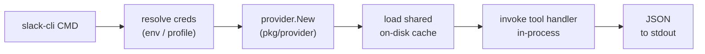

# slack-cli

A command-line interface for Slack workspaces, built on the
[`korotovsky/slack-mcp-server`](https://github.com/korotovsky/slack-mcp-server)
engine — the same stealth/OAuth auth, edge API, smart-history, and caching —
exposed as ordinary subcommands instead of a long-lived MCP server.

## Why a CLI instead of the MCP server?

An MCP server is one resident process **per agent** (stdio transport). Running
10+ agents means 10+ resident Slack servers, each warming and holding its own
user/channel cache. `slack-cli` is invoke-and-exit: each command is a
short-lived process that reads the **shared on-disk cache**, so process and
memory overhead don't scale with the number of agents. No daemon, no port, no
bearer token to manage — just a binary your agents call through their shell.

The original MCP server is still here (`cmd/slack-mcp-server`); the CLI is
additive and reuses the same `pkg/provider` engine unchanged.

## How it works

`slack-cli` doesn't reimplement Slack — it drives the **same tool handlers the
MCP server uses, in-process**. Each invocation:

1. **Resolves credentials** — explicit `SLACK_MCP_*` env/flags → `--profile` →
   default profile — and writes them into the env the engine reads.
2. **Builds the provider** (`pkg/provider`): the same stealth/OAuth auth, edge
   API, rate limiter, and caching the MCP server uses.
3. **Loads the shared on-disk cache** of users/channels (skip with
   `--no-cache`) so `#channel` and `@user` names resolve to IDs.
4. **Invokes the tool handler** for the subcommand directly — no MCP transport,
   no JSON-RPC — and prints its result to stdout as JSON for piping to `jq`.



The only glue between the CLI and the MCP toolset is `internal/toolcall`: it
turns a subcommand's flags into the arguments map a handler expects, calls the
handler, and returns its text. Command code never imports the MCP library, and
`pkg/handler` / `pkg/provider` are reused unchanged — so the bundled MCP server
(`cmd/slack-mcp-server`) keeps working and upstream updates still merge cleanly.

Because nothing stays resident, there's nothing to keep warm between calls: the
cost moves from "one server per agent, held for the whole session" to "one cache
read per command." The cache is shared across every invocation (and with the MCP
server) — refresh it explicitly with `slack-cli cache refresh`.

## Install

```sh
brew install paymog/tap/slack-cli
```

The formula builds from source, so Homebrew installs a Go toolchain as a build
dependency.

Go install:

```sh
go install github.com/paymog/slack-cli/cmd/slack-cli@latest
```

Local build:

```sh
make cli        # -> ./slack-cli
# or
go build ./cmd/slack-cli
```

## Auth

`slack-cli` accepts the same credentials as the MCP server. Provide **one** of:

- `SLACK_MCP_XOXP_TOKEN` — user OAuth token (`xoxp-…`), full features
- `SLACK_MCP_XOXB_TOKEN` — bot token (`xoxb-…`), limited (invited channels, no search)
- `SLACK_MCP_XOXC_TOKEN` + `SLACK_MCP_XOXD_TOKEN` — browser session token + cookie (`xoxc-…`/`xoxd-…`), stealth mode

The simplest setup for CI is environment variables (the `SLACK_CLI_*` prefix is
also accepted):

```sh
export SLACK_MCP_XOXP_TOKEN=xoxp-...
```

### Stored profiles

For day-to-day use, store credentials in named profiles. Tokens are kept in your
OS keyring (macOS Keychain, Linux libsecret/secret-service, Windows Credential
Manager); only non-secret metadata (auth mode, GovSlack flag) is written to
`~/.config/slack-cli/profiles.yaml` (XDG-aware; `%AppData%` on Windows).

```sh
slack-cli auth login              # prompts for mode + token(s); profile "default"
slack-cli auth login work --xoxp xoxp-...
slack-cli auth list               # table; * marks the default
slack-cli auth default work       # set the default profile
slack-cli --profile work channels list   # use a profile for one command
slack-cli auth status             # show which source resolved
slack-cli auth token              # print resolved tokens as SLACK_MCP_* lines
slack-cli auth logout work        # remove a profile (-f to skip confirm)
```

`login` validates credentials against Slack before saving. The first profile
added becomes the default.

**Credential precedence** (highest first):

1. explicit tokens via flags (`--xoxp`/`--xoxc`/…) or `SLACK_MCP_*` env vars
2. `--profile <name>` → stored profile
3. default profile → stored profile

Combining explicit tokens with `--profile` is rejected as ambiguous.

Global flags: `--govslack` (route to slack-gov.com), `--no-cache`, `--raw`
(print tool output verbatim), `--verbose`, `--timeout` (default 30s).

## Cache

Name lookups (`#channel`, `@user`) and `channels list` require a warm
user/channel cache. The cache is file-backed and shared across every
invocation (`SLACK_MCP_USERS_CACHE` / `SLACK_MCP_CHANNELS_CACHE`, TeamID-namespaced
under your OS cache dir by default).

```sh
slack-cli cache refresh           # fetch users + channels from Slack, write cache
```

Read commands load the on-disk cache automatically (and fetch on first run).
Pass `--no-cache` to skip it entirely — only raw channel/user IDs will resolve.

## Commands

```sh
# Channels
slack-cli channels list [--types public_channel,private_channel,im,mpim] [--query foo] [--limit 100]
slack-cli channels me

# Conversations
slack-cli conversations history <channel> [--limit 1d] [--cursor C] [--activity]
slack-cli conversations replies <channel> <thread_ts>
slack-cli conversations search [query] [--in-channel #general] [--from @user] [--after 2024-01-01]
slack-cli conversations unreads [--types all] [--mentions-only]
slack-cli conversations join <channel>
slack-cli conversations leave <channel>

# Users & groups
slack-cli users search <query> [--limit 10]
slack-cli usergroups list [--include-users]
slack-cli usergroups me <list|join|leave> [--usergroup-id S123]
slack-cli usergroups create --name "Eng" [--handle eng] [--channels C123]
slack-cli usergroups update <id> [--name ...] [--channels ...]
slack-cli usergroups users-update <id> --users U1,U2

# Saved items (browser tokens only)
slack-cli saved list [--filter saved|completed|archived]
slack-cli saved update <item_id> <ts> [--mark completed] [--date-due 0]
slack-cli saved clear-completed
```

### Write/sensitive commands (disabled by default)

Mirroring the MCP server, these require an opt-in environment variable so an
agent can't post or mutate by accident:

```sh
SLACK_MCP_ADD_MESSAGE_TOOL=true slack-cli conversations add <channel> -t "hello"
SLACK_MCP_ADD_MESSAGE_TOOL=C123,D456 slack-cli conversations add C123 -t "hi"   # channel allowlist
SLACK_MCP_MARK_TOOL=true           slack-cli conversations mark <channel> [--ts 123.456]
SLACK_MCP_REACTION_TOOL=true       slack-cli reactions add <channel> <ts> --emoji rocket
SLACK_MCP_REACTION_TOOL=true       slack-cli reactions remove <channel> <ts> --emoji rocket
SLACK_MCP_ATTACHMENT_TOOL=true     slack-cli attachments get <file_id> [-o path]
```

## Output

Tool output is JSON. Table results (channels, messages, users, saved items,
user groups) print as a JSON array of objects; status/JSON handlers print their
JSON verbatim. Everything is pipeable to `jq`, e.g. `slack-cli channels list |
jq -r '.[].Name'`. Table values are strings (CSV carries no types) — use jq's
`tonumber` when you need numbers. `--raw` prints the handler's bytes verbatim
(the original CSV/text the MCP server returns).

Binary attachments (`attachments get`) are the exception: the bytes come back
inline as base64 under `.content` (images included), so decode with `jq -r
.content | base64 --decode`. Or pass `-o <path>` to write the decoded bytes to a
file and keep stdout to a small metadata JSON — recommended for images and large
binaries so a multi-MB blob doesn't flood the terminal.

## Claude Code skill

This repo ships a [Claude Code](https://claude.com/claude-code) skill that
teaches the agent how to drive the CLI. It lives in
[`skills/slack-cli`](skills/slack-cli).

```sh
npx skills add paymog/slack-cli
```

## Shape

- `cmd/slack-cli` — CLI entrypoint.
- `internal/cli` — root command, global flags, `auth` subcommands.
- `internal/cmds` — one file per tool group; each subcommand invokes a handler.
- `internal/toolcall` — the only coupling to mcp-go: invokes the upstream tool
  handlers in-process (args map → request → text plus any image bytes), so
  `pkg/handler` stays unchanged and upstream merges stay clean.
- `internal/config`, `internal/credstore`, `internal/runtime`, `internal/output`
  — auth resolution, keyring profiles, provider bootstrap, result printing.
- `pkg/provider`, `pkg/handler`, … — the upstream engine, reused as-is.

## Release

Releases are tag-driven:

```sh
make release TAG=v0.1.0   # tags and pushes
```

GitHub Actions runs GoReleaser, then updates the source-build formula in
`paymog/homebrew-tap` (needs the `HOMEBREW_TAP_DEPLOY_KEY` secret).

## License

MIT, inherited from the upstream project. Not an official Slack product.
